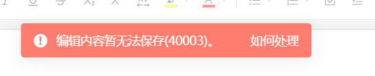
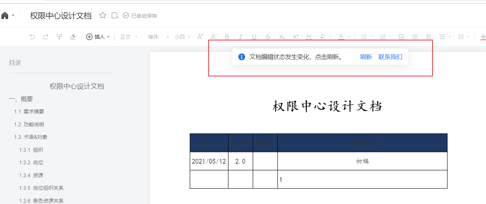
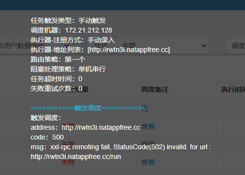
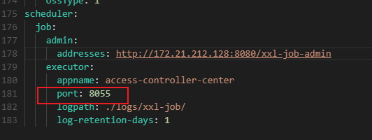

# 项目知识
SIT，(System integration testing)=系统集成测试
SAT，(System acceptance testing)=系统验收测试
UAT，(User Acceptance Test),也就是用户验收测试，或用户可接受测试，系统开发生命周期方法论的一个阶段，这时相关的用户或独立测试人员根据测试计划和结果对系统进行测试和接收。它让系统用户决定是否接收系统。它是一项确定产品是否能够满足合同或用户所规定需求的测试。这是管理性和防御性控制。


# Idea


```xml
<!-- idea RunDash配置-->
  <component name="RunDashboard">
    <option name="configurationTypes">
      <set>
        <option value="SpringBootApplicationConfigurationType" />
      </set>
    </option>
    <option name="ruleStates">
      <list>
        <RuleState>
          <option name="name" value="ConfigurationTypeDashboardGroupingRule" />
        </RuleState>
        <RuleState>
          <option name="name" value="StatusDashboardGroupingRule" />
        </RuleState>
      </list>
    </option>
    <option name="contentProportion" value="0.14925373" />
  </component>
```


maven打包不了  检查一下是不是pom.xml里面加了什么奇怪的配置比如下面那段

打包内存不够就加  maxmem  那些配置(或许可以直接加maven的配置文件？)

```xml
<?xml version="1.0" encoding="UTF-8"?>
<project xmlns="http://maven.apache.org/POM/4.0.0"
         xmlns:xsi="http://www.w3.org/2001/XMLSchema-instance"
         xsi:schemaLocation="http://maven.apache.org/POM/4.0.0 http://maven.apache.org/xsd/maven-4.0.0.xsd">
    <modelVersion>4.0.0</modelVersion>

    <groupId>com.bangdao.parking</groupId>
    <artifactId>saas-backapi</artifactId>
    <packaging>pom</packaging>
    <version>1.0.0-SNAPSHOT</version>
    <modules>
        <module>saas-backapi-facade</module>
        <module>saas-backapi-core</module>
    </modules>
    <parent>
        <groupId>com.bangdao.plat</groupId>
        <artifactId>tiny-boot-parents</artifactId>
        <version>1.2.0</version>
    </parent>
    <properties>
        <tinyboot-versio>1.2.0</tinyboot-versio>
        <mybatis.generator.version>1.3.5</mybatis.generator.version>
        <common.version>1.0.0-SNAPSHOT</common.version>
        <pagehelper.version>5.0.4</pagehelper.version>
        <integration.io.version>1.0.1-SNAPSHOT</integration.io.version>
        <aliyun.oss.version>2.5.0</aliyun.oss.version>
        <commons-lang3-version>3.8.1</commons-lang3-version>
        <jjwt-version>0.9.0</jjwt-version>
        <commons-fileupload-version>1.3.3</commons-fileupload-version>
        <mybatis-spring-boot-starter-version>1.3.2</mybatis-spring-boot-starter-version>
        <oshi-core-version>3.9.1</oshi-core-version>
        <druid.version>1.1.14</druid.version>
        <UserAgentUtils-version>1.19</UserAgentUtils-version>
        <guava.version>20.0</guava.version>
        <tk.version>2.0.0</tk.version>
        <mysql.version>5.1.34</mysql.version>
        <common.sharding.jdbc>1.0.0-SNAPSHOT</common.sharding.jdbc>
    </properties>

    <dependencyManagement>
        <dependencies>
            <dependency>
                <groupId>com.bangdao.plat</groupId>
                <artifactId>tiny-boot-starter-cache</artifactId>
                <version>${tinyboot-versio}</version>
                <exclusions>
                    <exclusion>
                        <groupId>com.google.guava</groupId>
                        <artifactId>guava</artifactId>
                    </exclusion>
                </exclusions>
            </dependency>
            <dependency>
                <groupId>com.bangdao.plat</groupId>
                <artifactId>tiny-boot-starter-core</artifactId>
                <version>${tinyboot-versio}</version>
                <exclusions>
                    <exclusion>
                        <groupId>com.google.guava</groupId>
                        <artifactId>guava</artifactId>
                    </exclusion>
                </exclusions>
            </dependency>
            <dependency>
                <groupId>com.bangdao.parking</groupId>
                <artifactId>common-core</artifactId>
                <version>${common.version}</version>
            </dependency>
            <dependency>
                <groupId>com.github.pagehelper</groupId>
                <artifactId>pagehelper</artifactId>
                <version>${pagehelper.version}</version>
            </dependency>
            <!--导出插件-->
            <dependency>
                <groupId>com.alibaba</groupId>
                <artifactId>easyexcel</artifactId>
                <version>1.1.2-beta5</version>
            </dependency>
            <!--导出插件end-->
            <dependency>
                <groupId>com.bangdao.parking</groupId>
                <artifactId>integration-io-facade</artifactId>
                <version>${integration.io.version}</version>
            </dependency>
            <dependency>
                <groupId>com.bangdao.plat</groupId>
                <artifactId>tiny-boot-starter-dubbo-support</artifactId>
                <version>${tinyboot-versio}</version>
            </dependency>
            <dependency>
                <groupId>org.apache.curator</groupId>
                <artifactId>curator-framework</artifactId>
                <version>2.11.1</version>
            </dependency>
            <dependency>
                <groupId>org.apache.curator</groupId>
                <artifactId>curator-recipes</artifactId>
                <version>2.10.0</version>
            </dependency>
            <dependency>
                <groupId>com.aliyun.oss</groupId>
                <artifactId>aliyun-sdk-oss</artifactId>
                <version>${aliyun.oss.version}</version>
            </dependency>
            <!--常用工具类 -->
            <dependency>
                <groupId>org.apache.commons</groupId>
                <artifactId>commons-lang3</artifactId>
                <version>${commons-lang3-version}</version>
            </dependency>
            <!--Token生成与解析-->
            <dependency>
                <groupId>io.jsonwebtoken</groupId>
                <artifactId>jjwt</artifactId>
                <version>${jjwt-version}</version>
            </dependency>
            <!--文件上传工具类 -->
            <dependency>
                <groupId>commons-fileupload</groupId>
                <artifactId>commons-fileupload</artifactId>
                <version>${commons-fileupload-version}</version>
            </dependency>
            <!-- SpringBoot集成mybatis框架 -->
            <dependency>
                <groupId>org.mybatis.spring.boot</groupId>
                <artifactId>mybatis-spring-boot-starter</artifactId>
                <version>${mybatis-spring-boot-starter-version}</version>
            </dependency>
            <!-- 获取系统信息 -->
            <dependency>
                <groupId>com.github.oshi</groupId>
                <artifactId>oshi-core</artifactId>
                <version>${oshi-core-version}</version>
            </dependency>
            <!-- Spring框架基本的核心工具 -->

            <!-- 解析客户端操作系统、浏览器等 -->
            <dependency>
                <groupId>eu.bitwalker</groupId>
                <artifactId>UserAgentUtils</artifactId>
                <version>${UserAgentUtils-version}</version>
            </dependency>
            <dependency>
                <groupId>com.bangdao.parking</groupId>
                <artifactId>common-monitor</artifactId>
                <version>1.0.0-SNAPSHOT</version>
            </dependency>
            <dependency>
                <groupId>tk.mybatis</groupId>
                <artifactId>mapper-spring-boot-starter</artifactId>
                <version>${tk.version}</version>
            </dependency>
            <dependency>
                <groupId>com.alibaba</groupId>
                <artifactId>druid</artifactId>
                <version>${druid.version}</version>
            </dependency>
            <dependency>
                <groupId>mysql</groupId>
                <artifactId>mysql-connector-java</artifactId>
                <version>${mysql.version}</version>
            </dependency>
            <dependency>
                <groupId>com.bangdao.parking</groupId>
                <artifactId>common-sharding-jdbc</artifactId>
                <version>${common.sharding.jdbc}</version>
            </dependency>
            <dependency>
                <groupId>com.google.guava</groupId>
                <artifactId>guava</artifactId>
                <version>${guava.version}</version>
            </dependency>
            <!--<dependency>
                <groupId>com.bangdao.parking</groupId>
                <artifactId>common-swagger</artifactId>
                <version>1.0.0-SNAPSHOT</version>
            </dependency>-->
        </dependencies>
    </dependencyManagement>
    <build>
        <plugins>
            <plugin>
                <groupId>org.apache.maven.plugins</groupId>
                <artifactId>maven-compiler-plugin</artifactId>
                <configuration>
                    <source>1.8</source>
                    <target>1.8</target>
                    <!--内存不足配置-->
                    <fork>true</fork>
                    <meminitial>512m</meminitial>
                    <maxmem>1048m</maxmem>
                </configuration>
            </plugin>
            <!--MG的插件-->
            <plugin>
                <groupId>org.mybatis.generator</groupId>
                <artifactId>mybatis-generator-maven-plugin</artifactId>
                <version>${mybatis.generator.version}</version>
                <configuration>
                    <verbose>true</verbose>
                    <overwrite>true</overwrite>
                    <configurationFile>src/test/resources/generatorConfig.xml</configurationFile>
                </configuration>
                <dependencies>
                    <dependency>
                        <groupId>mysql</groupId>
                        <artifactId>mysql-connector-java</artifactId>
                        <version>5.1.38</version>
                    </dependency>
                    <dependency>
                        <groupId>tk.mybatis</groupId>
                        <artifactId>mapper</artifactId>
                        <version>${mapper.version}</version>
                    </dependency>
                </dependencies>
            </plugin>

            <plugin>
                <groupId>org.apache.maven.plugins</groupId>
                <artifactId>maven-jar-plugin</artifactId>
                <version>2.6</version>
                <configuration>
                    <archive>
                        <!-- 添加index则不从mainfest中读取classpath，而是从Index.list中读取 -->
                        <!-- <index>true</index> -->
                        <manifest>
                            <mainClass>com.bangdao.parking.saasapi.Application</mainClass>
                            <addClasspath>true</addClasspath>
                            <classpathPrefix>locallib/</classpathPrefix>
                            <useUniqueVersions>false</useUniqueVersions>
                        </manifest>
                        <manifestEntries>
                            <Class-Path>./</Class-Path>
                        </manifestEntries>
                    </archive>
                    <!--<excludes>
                        <exclude>*.yml</exclude>
                    </excludes>-->
                </configuration>
            </plugin>
            <plugin>
                <groupId>org.apache.maven.plugins</groupId>
                <artifactId>maven-dependency-plugin</artifactId>
                <executions>
                    <execution>
                        <id>copy</id>
                        <phase>package</phase>
                        <goals>
                            <goal>copy-dependencies</goal>
                        </goals>
                        <configuration>
                            <outputDirectory>${project.build.directory}/locallib</outputDirectory>
                            <overWriteReleases>false</overWriteReleases>
                            <overWriteSnapshots>false</overWriteSnapshots>
                            <overWriteIfNewer>true</overWriteIfNewer>
                        </configuration>
                    </execution>
                </executions>
            </plugin>
            <!--<plugin>-->
                <!--<groupId>com.github.shalousun</groupId>-->
                <!--<artifactId>smart-doc-maven-plugin</artifactId>-->
                <!--<version>2.2.4</version>-->
                <!--<configuration>-->
                    <!--&lt;!&ndash;指定生成文档的使用的配置文件,配置文件放在自己的项目中&ndash;&gt;-->
                    <!--<configFile>./../smart-doc.json</configFile>-->
                    <!--&lt;!&ndash;指定项目名称&ndash;&gt;-->
                    <!--<projectName>前端api</projectName>-->
                    <!--&lt;!&ndash;smart-doc实现自动分析依赖树加载第三方依赖的源码，如果一些框架依赖库加载不到导致报错，这时请使用excludes排除掉&ndash;&gt;-->
                    <!--<excludes>-->
                        <!--&lt;!&ndash;格式为：groupId:artifactId;参考如下&ndash;&gt;-->
                        <!--<exclude>com.alibaba:fastjson</exclude>-->
                    <!--</excludes>-->
                    <!--&lt;!&ndash;自1.0.8版本开始，插件提供includes支持,配置了includes后插件会按照用户配置加载而不是自动加载，因此使用时需要注意&ndash;&gt;-->
                    <!--&lt;!&ndash;smart-doc能自动分析依赖树加载所有依赖源码，原则上会影响文档构建效率，因此你可以使用includes来让插件加载你配置的组件&ndash;&gt;-->
                    <!--<includes>-->
                        <!--&lt;!&ndash;格式为：groupId:artifactId;参考如下&ndash;&gt;-->
                        <!--<include>com.alibaba:fastjson</include>-->
                    <!--</includes>-->
                <!--</configuration>-->
                <!--<executions>-->
                    <!--<execution>-->
                        <!--&lt;!&ndash;如果不需要在执行编译时启动smart-doc，则将phase注释掉&ndash;&gt;-->
                        <!--<phase>compile</phase>-->
                        <!--<goals>-->
                            <!--&lt;!&ndash;smart-doc提供了html、openapi、markdown等goal，可按需配置&ndash;&gt;-->
                            <!--<goal>html</goal>-->
                        <!--</goals>-->
                    <!--</execution>-->
                <!--</executions>-->
            <!--</plugin>-->
        </plugins>
    </build>

    <distributionManagement>
        <snapshotRepository>
            <id>Snapshots</id>
            <url>http://maven.bangdao-tech.com/nexus/content/repositories/test-maven/</url>
            <uniqueVersion>true</uniqueVersion>
        </snapshotRepository>
    </distributionManagement>

</project>
```


# Java

## 知识点

日志要打印全，不要怕日志文件大（尽量小），不管是成功的还是失败的，方便用于排查

>  1.Java日期中YYYY与yyyy的区别【重要】

````java
//YYYY是表示：当天所在的周属于的年份，一周从周日开始，周六结束，只要本周跨年，那么这周就算入下一年。
//总之都用yyyy就对了

````


## 使用集锦


### 请求接口

```java
package com.bangdao.parking.saas_taskjob.core.service.impl;

import java.text.ParseException;
import java.util.Date;

import com.alibaba.fastjson.JSON;
import com.alibaba.fastjson.JSONArray;
import com.alibaba.fastjson.JSONObject;
import com.bangdao.parking.common.utils.TinyUUIDGenerator;
import com.bangdao.parking.common.utils.http.OkHttpClient;
import com.bangdao.parking.common.utils.http.OkHttpParam;
import com.bangdao.parking.common.utils.http.OkHttpResult;
import com.bangdao.parking.saas_taskjob.common.dal.dao.*;
import com.bangdao.parking.saas_taskjob.common.dal.pojo.*;
import com.bangdao.parking.saas_taskjob.common.dal.vo.CpYongshengProjectRelVO;
import com.bangdao.parking.saas_taskjob.core.service.XinShiChuanCustHouseInfoSyncService;
import com.bangdao.parking.saas_taskjob.core.service.enums.YongShengEnums;
import com.bangdao.tiny.boot.core.domain.BusinessException;
import okhttp3.MediaType;
import org.apache.commons.lang3.StringUtils;
import org.slf4j.Logger;
import org.slf4j.LoggerFactory;
import org.springframework.beans.factory.annotation.Autowired;
import org.springframework.beans.factory.annotation.Value;
import org.springframework.stereotype.Service;

import java.text.SimpleDateFormat;
import java.util.*;

@Service
public class XinShiChuanCustHouseInfoSyncServiceImpl implements XinShiChuanCustHouseInfoSyncService {

	private Logger logger = LoggerFactory.getLogger(this.getClass());

	@Autowired
	YSOrgDepDao ysOrgDepDao;
	@Autowired
	CpYongshengTaskJobDao cpYongshengTaskJobDao;
	@Autowired
	CpParkingSpaceDao cpParkingSpaceDao;
	@Autowired
	CpParkingSpaceHouseDao cpParkingSpaceHouseDao;
	@Autowired
	CpParkingSpaceHouseUserRelDao cpParkingSpaceHouseUserRelDao;
	@Autowired
	CpYongshengProjectRelDao cpYongshengProjectRelDao;

	@Autowired
	ParkingSpaceUserDao cpParkingSpaceUserDao;
	private static final SimpleDateFormat format = new SimpleDateFormat("yyyy-MM-dd hh:mm:ss");
	private static String initStartTime = "1990-01-01 00:00:00";
	private static final int defaultPageSize = 200;

	@Value("${xinshichuang.domain:''}")
	private String domain;
	@Value("${xinshichuang.url:''}")
	private String url;


	public ThirdPageDto getThirdData(TempDate yesterdayTime, String businessCode, int pageNum, int pageSize) throws BusinessException {

		HashMap<String, Object> param = new HashMap<>();
		param.put("startTime", yesterdayTime.getStartTime());
		param.put("endTime", yesterdayTime.getEndTime());
		param.put("businessCode", businessCode);//接口代码
		param.put("pageNum", pageNum);
		param.put("pageSize", pageSize);
//		param.put("newseeId",page);//新视窗主键ID
//		param.put("thirdId",parkSpace);//第三方ID
//		param.put("enterpriseId",parkSpace);//租户id

		String jsonData = JSONObject.toJSONString(param);

		OkHttpParam okHttpParam = new OkHttpParam();
		okHttpParam.setMediaType(MediaType.parse("application/json;charset=utf-8"));

		Map<String, String> header = new HashMap<>();
		okHttpParam.setHeader(header);
		okHttpParam.setApiUrl(domain + url);
		try {
			OkHttpResult<String> okHttpResult = OkHttpClient.post(okHttpParam, jsonData, String.class);
			ThirdPageDto result = JSON.parseObject(okHttpResult.getResult(), ThirdPageDto.class);
			JSONObject resultObj = JSON.parseObject(okHttpResult.getResult());
			JSONArray data = resultObj.getJSONArray("data");
			result.setJsonData(data);
			return result;
		} catch (Exception e) {
			e.printStackTrace();
			logger.info("查询三方请求错误，三方请求或解析结果错误[{}]", e.getMessage());
			throw new BusinessException("查询三方请求错误，三方请求或解析结果错误:" + e.getMessage());
		}
	}


	/**
	 * 客户数据同步
	 * @param param
	 * @throws BusinessException
	 */
	@Override
	public void xscUserInfoSync(String param) throws BusinessException {
		logger.info("新视窗客户数据开始同步至车行");
		Date start = new Date();
		CpYongshengTaskJobPO result = new CpYongshengTaskJobPO();
		result.setId(TinyUUIDGenerator.generate());
		result.setResult(YongShengEnums.YS_RESULTTYPE_SUCCESS.getCode());
		StringBuilder resultText = new StringBuilder();
		int totalCount = 0;
		int successCount = 0;
		int total = 0;
		//获取昨天起始时间
//		TempDate tempDate = getYesterdayTime();
		//1.查询定时表上次成功的时间
		TempDate tempDate = getLastSucceedTime(YongShengEnums.YS_TASKTYPE_USER,param);

		try {
			//分页获取三方数据
			int pageNum = 1;
			int pageSize = defaultPageSize;
			total = 0;
			List<SysOrgDepPo> sysOrgDepPos = ysOrgDepDao.selectCodeAndId();
			Map<String, String> orgCodeIdMap = sysOrgDepPos.stream().collect(HashMap::new, (m, v) -> m.put(v.getOrgDepCode(), Optional.ofNullable(v.getOrgDepId()).orElse("")), HashMap::putAll);
			while (true) {
				ThirdPageDto resultObj = getThirdData(tempDate, YongShengEnums.YS_BUSINESS_CODE_USER.getCode(), pageNum, pageSize);
				if (total == 0) {
					total = resultObj.getTotal();
				}
				List<ThirdSpaceUserDto> responseList = resultObj.getJsonData().toJavaList(ThirdSpaceUserDto.class);
				System.out.println(responseList);

				//三方id集合(检验数据是否已存在)
				List<String> ownerIds = responseList.stream().collect(ArrayList::new, (m, v) -> m.add(v.getOwnerId()), ArrayList::addAll);
				List<ParkingSpaceUserPo> checkList = cpParkingSpaceUserDao.selectThirdIdUserIdByThirdIds(ownerIds);
				//三方Id/主键Id
				Map<String, String> thirdIdUserIdMap = checkList.stream().collect(HashMap::new, (m, v) -> m.put(v.getThirdId(), Optional.ofNullable(v.getPkUserId()).orElse("")), HashMap::putAll);

				//循环转换处理，入库
				for (ThirdSpaceUserDto cur : responseList) {
					String otype = "";
					ParkingSpaceUserPo data = new ParkingSpaceUserPo();
					try {
						//根据所属项目id  precinctId(orgDepCode)    查询  组织id
						data.setParkId(orgCodeIdMap.get(cur.getPrecinctId()));
						data.setThirdId(cur.getOwnerId());
						data.setName(cur.getOwnerName());
						data.setPhoneNumber(noToooLongHandle(cur.getMobile(),11));
						if ("10".equals(cur.getCertificateType())) {//身份证号
							data.setCardType("01");
							data.setCardNumber(noToooLongHandle(cur.getCertificate(),60));
						}
						if ("11".equals(cur.getCertificateType())) {//护照
							data.setCardType("02");
							data.setCardNumber(noToooLongHandle(cur.getCertificate(),60));
						}
						if ("20".equals(cur.getCertificateType())) {//营业执照
							data.setCardType("03");
							data.setCardNumber(noToooLongHandle(cur.getCertificate(),60));
						}
						data.setRoomNumber(cur.getAddress());
						data.setDeleted(Integer.valueOf(cur.getIsDeleted()));
						data.setUserType(handlerUserType(cur.getOwnerProperty()));
						data.setPrecinctId(noToooLongHandle(cur.getPrecinctId(),64));
						data.setCompany(noToooLongHandle(cur.getCompany(),100));
						String pkUserId = thirdIdUserIdMap.get(data.getThirdId());
						if (StringUtils.isNotBlank(pkUserId)) {//更新
							otype = "update";
							data.setPkUserId(pkUserId);
							data.setUpdateTime(new Date());
							data.setUpdateBy("admin");
							int i = cpParkingSpaceUserDao.updateByPrimaryKeySelective(data);
							if (i != 1) {
								throw new BusinessException("客户保存失败" + otype + ":" + data.toString());
							}
							System.out.println(i + data.toString());
						} else {//新增
							otype = "add";
							data.setPkUserId(TinyUUIDGenerator.generate());
							data.setCreateTime(new Date());
							data.setCreateBy("admin");
							data.setVersion(0);
							int i = cpParkingSpaceUserDao.insertSelective(data);
							if (i != 1) {
								throw new BusinessException("客户保存失败" + otype + ":" + data.toString());
							}
						}
						successCount++;
					} catch (Exception e) {
						e.printStackTrace();
						result.setResult(YongShengEnums.YS_RESULTTYPE_FAIL.getCode());
						logger.error("同步新视窗客户数据异常【{}】【{}】【{}】", otype,  data.toString(),e.getMessage());
					}
				}
				if (responseList.size() < 1) {
					break;
				} else {
					totalCount += responseList.size();
					pageNum++;
				}
			}
		} catch (Exception e) {
			e.printStackTrace();
			resultText.append(e.getMessage() + tempDate.toString());
			result.setResult(YongShengEnums.YS_RESULTTYPE_FAIL.getCode());
			throw new BusinessException(e.getMessage());
		} finally {
			result.setTaskType(YongShengEnums.YS_TASKTYPE_USER.getCode());
			result.setCreateTime(start);
			result.setCreateBy("新视窗数据同步定时任务");
			result.setUpdateTime(new Date());
			result.setUpdateBy("新视窗数据同步定时任务");
			resultText.append("[完成 ,总数" + total + ",操作总数" + totalCount + ",成功" + successCount + "]");
			result.setReamrkData(resultText.toString());
			cpYongshengTaskJobDao.insertSelective(result);
			logger.info("永升客户数据开始同步至车行完成,结果：【{}】【{}】", result.getResult(), result.getReamrkData());
		}
	}

	/**
	 * 房产数据同步
	 * @param param
	 * @throws BusinessException
	 */
	@Override
	public void xscHouseInfoSync(String param) throws BusinessException {
		logger.info("新视窗房产数据开始同步至车行");
		Date start = new Date();
		CpYongshengTaskJobPO result = new CpYongshengTaskJobPO();
		result.setId(TinyUUIDGenerator.generate());
		result.setResult(YongShengEnums.YS_RESULTTYPE_SUCCESS.getCode());
		StringBuilder resultText = new StringBuilder();
		int totalCount = 0;
		int successCount = 0;
		int total = 0;
		//获取昨天起始时间
//		TempDate tempDate = getYesterdayTime();
		//1.查询定时表上次成功的时间
		TempDate tempDate = getLastSucceedTime(YongShengEnums.YS_TASKTYPE_HOUSE, param);

		try {
			//分页获取三方数据
			int pageNum = 1;
			int pageSize = defaultPageSize;
			total = 0;
			while (true) {
				ThirdPageDto resultObj = getThirdData(tempDate, YongShengEnums.YS_BUSINESS_CODE_HOUSE.getCode(), pageNum, pageSize);
				if (total == 0) {
					total = resultObj.getTotal();
				}
				List<CpParkingSpaceHousePO> responseList = resultObj.getJsonData().toJavaList(CpParkingSpaceHousePO.class);
				System.out.println(responseList);

				//三方id集合(检验数据是否已存在)
				List<String> houseIds = responseList.stream().collect(ArrayList::new, (m, v) -> m.add(v.getHouseId()), ArrayList::addAll);
				List<CpParkingSpaceHousePO> checkList = cpParkingSpaceHouseDao.selectHouseIdPkIdByHouseIds(houseIds);
				//三方Id/主键Id
				Map<String, String> houseIdPkIdMap = checkList.stream().collect(HashMap::new, (m, v) -> m.put(v.getHouseId(), Optional.ofNullable(v.getPkId()).orElse("")), HashMap::putAll);

				//循环转换处理，入库
				for (CpParkingSpaceHousePO cur : responseList) {
					String otype = "";
					CpParkingSpaceHousePO data = new CpParkingSpaceHousePO();

					try {
						data.setHouseId(cur.getHouseId());
						data.setHouseName(cur.getHouseName());
						data.setHouseNo(cur.getHouseNo());
						data.setPath(cur.getPath());
						data.setPrecinctId(cur.getPrecinctId());
						data.setPrecinctName(cur.getPrecinctName());
						data.setParentId(cur.getParentId());
						data.setFloor(cur.getFloor());
						data.setFloorNum(cur.getFloorNum());
						data.setIsDeleted(cur.getIsDeleted());
						String pkId = houseIdPkIdMap.get(data.getHouseId());
						if (StringUtils.isNotBlank(pkId)) {//更新
							otype = "update";
							data.setPkId(pkId);
							data.setUpDateUseName("admin");
							data.setUpDateTime(new Date());
							int i = cpParkingSpaceHouseDao.updateByPrimaryKeySelective(data);
							if (i != 1) {
								throw new BusinessException("房产保存失败" + otype + ":" + data.toString());
							}
							System.out.println(i + data.toString());
						} else {//新增
							otype = "add";
							data.setPkId(TinyUUIDGenerator.generate());
							data.setCreateTime(new Date());
							data.setCreateUserName("admin");
							data.setCreateTime(new Date());
							int i = cpParkingSpaceHouseDao.insertSelective(data);
							if (i != 1) {
								throw new BusinessException("房产保存失败" + otype + ":" + data.toString());
							}
						}
						successCount++;
					} catch (Exception e) {
						e.printStackTrace();
						result.setResult(YongShengEnums.YS_RESULTTYPE_FAIL.getCode());
						logger.error("同步新视窗房产数据异常【{}】【{}】【{}】", otype,  data.toString(),e.getMessage());
					}
				}
				if (responseList.size() < 1) {
					break;
				} else {
					totalCount += responseList.size();
					pageNum++;
				}
			}
		} catch (Exception e) {
			e.printStackTrace();
			resultText.append(e.getMessage() + tempDate.toString());
			result.setResult(YongShengEnums.YS_RESULTTYPE_FAIL.getCode());
			throw new BusinessException(e.getMessage());
		} finally {
			result.setTaskType(YongShengEnums.YS_TASKTYPE_HOUSE.getCode());
			result.setCreateTime(start);
			result.setCreateBy("新视窗数据同步定时任务");
			result.setUpdateTime(new Date());
			result.setUpdateBy("新视窗数据同步定时任务");
			resultText.append("[完成 ,总数" + total + ",操作总数" + totalCount + ",成功" + successCount + "]");
			result.setReamrkData(resultText.toString());
			cpYongshengTaskJobDao.insertSelective(result);
			logger.info("永升房产数据开始同步至车行完成,结果：【{}】【{}】", result.getResult(), result.getReamrkData());
		}
	}

	/**
	 * 人房关系数据同步
	 * @param param
	 * @throws BusinessException
	 */
	@Override
	public void xscUserHouseRelInfoSync(String param) throws BusinessException {
		logger.info("新视窗人房关系数据开始同步至车行");
		Date start = new Date();
		CpYongshengTaskJobPO result = new CpYongshengTaskJobPO();
		result.setId(TinyUUIDGenerator.generate());
		result.setResult(YongShengEnums.YS_RESULTTYPE_SUCCESS.getCode());
		StringBuilder resultText = new StringBuilder();
		int totalCount = 0;
		int successCount = 0;
		int total = 0;
		//获取昨天起始时间
//		TempDate tempDate = getYesterdayTime();
		//1.查询定时表上次成功的时间
		TempDate tempDate = getLastSucceedTime(YongShengEnums.YS_TASKTYPE_REL, param);

		try {
			//分页获取三方数据
			int pageNum = 1;
			int pageSize = defaultPageSize;
			total = 0;
			while (true) {
				ThirdPageDto resultObj = getThirdData(tempDate, YongShengEnums.YS_BUSINESS_CODE_REL.getCode(), pageNum, pageSize);
				if (total == 0) {
					total = resultObj.getTotal();
				}
				List<CpParkingSpaceHouseUserRelPO> responseList = resultObj.getJsonData().toJavaList(CpParkingSpaceHouseUserRelPO.class);
				System.out.println(responseList);

				//三方id集合(检验数据是否已存在)
				List<String> relIds = responseList.stream().collect(ArrayList::new, (m, v) -> m.add(v.getHouseOwnerRelationshipId()), ArrayList::addAll);
				List<CpParkingSpaceHouseUserRelPO> checkList = cpParkingSpaceHouseUserRelDao.selectRelIdPkIdByHouseIds(relIds);
				//三方Id/主键Id
				Map<String, String> relIdPkIdMap = checkList.stream().collect(HashMap::new, (m, v) -> m.put(v.getHouseOwnerRelationshipId(), Optional.ofNullable(v.getPkId()).orElse("")), HashMap::putAll);

				//循环转换处理，入库
				for (CpParkingSpaceHouseUserRelPO cur : responseList) {
					String otype = "";
					CpParkingSpaceHouseUserRelPO data = new CpParkingSpaceHouseUserRelPO();
					try {
						data.setHouseOwnerRelationshipId(cur.getHouseOwnerRelationshipId());
						data.setOwnerId(cur.getOwnerId());
						data.setHouseId(cur.getHouseId());
						data.setPrecinctId(cur.getPrecinctId());
						data.setIsDeleted(cur.getIsDeleted());
						data.setIsCurrentRecord(cur.getIsCurrentRecord());
						data.setOwnerProperty(cur.getOwnerProperty());
						String pkId = relIdPkIdMap.get(data.getHouseOwnerRelationshipId());
						if (StringUtils.isNotBlank(pkId)) {//更新
							otype = "update";
							data.setPkId(pkId);
							data.setUpDateUseName("admin");
							data.setUpDateTime(new Date());
							int i = cpParkingSpaceHouseUserRelDao.updateByPrimaryKeySelective(data);
							if (i != 1) {
								throw new BusinessException("人房关系保存失败" + otype + ":" + data.toString());
							}
							System.out.println(i + data.toString());
						} else {//新增
							otype = "add";
							data.setPkId(TinyUUIDGenerator.generate());
							data.setCreateTime(new Date());
							data.setCreateUserName("admin");
							data.setCreateTime(new Date());
							int i = cpParkingSpaceHouseUserRelDao.insertSelective(data);
							if (i != 1) {
								throw new BusinessException("人房关系保存失败" + otype + ":" + data.toString());
							}
						}
						successCount++;
					} catch (Exception e) {
						e.printStackTrace();
						result.setResult(YongShengEnums.YS_RESULTTYPE_FAIL.getCode());
						logger.error("同步新视窗人房关系数据异常【{}】【{}】【{}】", otype,  data.toString(),e.getMessage());
					}
				}
				if (responseList.size() < 1) {
					break;
				} else {
					totalCount += responseList.size();
					pageNum++;
				}
			}
		} catch (Exception e) {
			e.printStackTrace();
			resultText.append(e.getMessage() + tempDate.toString());
			result.setResult(YongShengEnums.YS_RESULTTYPE_FAIL.getCode());
			throw new BusinessException(e.getMessage());
		} finally {
			result.setTaskType(YongShengEnums.YS_TASKTYPE_REL.getCode());
			result.setCreateTime(start);
			result.setCreateBy("新视窗数据同步定时任务");
			result.setUpdateTime(new Date());
			result.setUpdateBy("新视窗数据同步定时任务");
			resultText.append("[完成 ,总数" + total + ",操作总数" + totalCount + ",成功" + successCount + "]");
			result.setReamrkData(resultText.toString());
			cpYongshengTaskJobDao.insertSelective(result);
			logger.info("永升人房关系数据开始同步至车行完成,结果：【{}】【{}】", result.getResult(), result.getReamrkData());
		}
	}

	@Override
	public void xscProjectCodeRelInfoSync(String param) throws BusinessException {
		logger.info("新视窗永升项目关系数据开始同步至车行");
		Date start = new Date();
		CpYongshengTaskJobPO result = new CpYongshengTaskJobPO();
		result.setId(TinyUUIDGenerator.generate());
		result.setResult(YongShengEnums.YS_RESULTTYPE_SUCCESS.getCode());
		StringBuilder resultText = new StringBuilder();
		int totalCount = 0;
		int successCount = 0;
		int total = 0;
		//获取昨天起始时间
//		TempDate tempDate = getYesterdayTime();
		//1.查询定时表上次成功的时间
		TempDate tempDate = getLastSucceedTime(YongShengEnums.YS_TASKTYPE_PROJECT_REL, param);

		try {
			//分页获取三方数据
			int pageNum = 1;
			int pageSize = defaultPageSize;
			total = 0;
			while (true) {
				ThirdPageDto resultObj = getThirdData(tempDate, YongShengEnums.YS_BUSINESS_CODE_PROJECT_REL.getCode(), pageNum, pageSize);
				if (total == 0) {
					total = resultObj.getTotal();
				}
				List<CpYongshengProjectRelVO> responseList = resultObj.getJsonData().toJavaList(CpYongshengProjectRelVO.class);
				System.out.println(responseList);

				//三方id集合(检验数据是否已存在)
				List<String> houseIds = responseList.stream().collect(ArrayList::new, (m, v) -> m.add(v.getHouseId()), ArrayList::addAll);
				List<CpYongshengProjectRelPO> checkList = cpYongshengProjectRelDao.selectByHouseIds(houseIds);
				//三方Id/主键Id
				Map<String, String> houseIdMap = checkList.stream().collect(HashMap::new, (m, v) -> m.put(v.getHouseId(), Optional.ofNullable(v.getHouseId()).orElse("")), HashMap::putAll);

				//循环转换处理，入库
				for (CpYongshengProjectRelVO cur : responseList) {
					String otype = "";
					CpYongshengProjectRelPO data = new CpYongshengProjectRelPO();
					try {
						data.setHouseId(cur.getHouseId());
						data.setName(cur.getName());
						data.setHouseNo(cur.getHouseNo());
						data.setCode(cur.getOrganizationCode());
						data.setIsDeleted(0);
						data.setCreateUserName("");
						data.setCreateTime(new Date());
						data.setUpDateUserName("");
						data.setUpDateTime(new Date());
						String pkId = houseIdMap.get(data.getHouseId());
						if (StringUtils.isNotBlank(pkId)) {//更新
							otype = "update";
							data.setUpDateUserName("admin");
							data.setUpDateTime(new Date());
							int i = cpYongshengProjectRelDao.updateByPrimaryKeySelective(data);
							if (i != 1) {
								throw new BusinessException("永升项目关系保存失败" + otype + ":" + data.toString());
							}
							System.out.println(i + data.toString());
						} else {//新增
							otype = "add";
							data.setCreateTime(new Date());
							data.setCreateUserName("admin");
							data.setCreateTime(new Date());
							int i = cpYongshengProjectRelDao.insertSelective(data);
							if (i != 1) {
								throw new BusinessException("永升项目关系保存失败" + otype + ":" + data.toString());
							}
						}
						successCount++;
					} catch (Exception e) {
						e.printStackTrace();
						result.setResult(YongShengEnums.YS_RESULTTYPE_FAIL.getCode());
						logger.error("同步新视窗永升项目关系数据异常【{}】【{}】【{}】", otype,  data.toString(),e.getMessage());
					}
				}
				if (responseList.size() < 1) {
					break;
				} else {
					totalCount += responseList.size();
					pageNum++;
				}
			}
		} catch (Exception e) {
			e.printStackTrace();
			resultText.append(e.getMessage() + tempDate.toString());
			result.setResult(YongShengEnums.YS_RESULTTYPE_FAIL.getCode());
			throw new BusinessException(e.getMessage());
		} finally {
			result.setTaskType(YongShengEnums.YS_TASKTYPE_PROJECT_REL.getCode());
			result.setCreateTime(start);
			result.setCreateBy("新视窗数据同步定时任务");
			result.setUpdateTime(new Date());
			result.setUpdateBy("新视窗数据同步定时任务");
			resultText.append("[完成 ,总数" + total + ",操作总数" + totalCount + ",成功" + successCount + "]");
			result.setReamrkData(resultText.toString());
			cpYongshengTaskJobDao.insertSelective(result);
			logger.info("永升项目关系数据开始同步至车行完成,结果：【{}】【{}】", result.getResult(), result.getReamrkData());
		}
	}


	private TempDate getLastSucceedTime(YongShengEnums type, String param) throws BusinessException {
		//1.查询定时表上次成功的时间
		TempDate tempDate = new TempDate();
		tempDate.setEndTime(System.currentTimeMillis());
		CpYongshengTaskJobPO taskPO = cpYongshengTaskJobDao.queryLastTaskRecordByType(type.getCode());
		if (taskPO != null) {
			tempDate.setStartTime(taskPO.getCreateTime().getTime());
		} else {
			try {
				tempDate.setStartTime(format.parse(initStartTime).getTime());
			} catch (ParseException e) {
				e.printStackTrace();
				logger.info("组织任务初始化时间转换错误");
				throw new BusinessException("初始化时间转换错误");
			}
		}
		if(StringUtils.isNotBlank(param)){
			try {
				tempDate.setStartTime(format.parse(param).getTime());
			} catch (ParseException e) {
				e.printStackTrace();
				logger.info("组织任务初始化时间转换错误2");
				throw new BusinessException("初始化时间转换错误2");
			}
		}
		return tempDate;
	}

	public TempDate getYesterdayTime() {
		TempDate tempDate = new TempDate();
		Calendar cal = Calendar.getInstance();
		cal.add(Calendar.DATE, -1);
		cal.set(Calendar.HOUR_OF_DAY, 0);
		cal.set(Calendar.SECOND, 0);
		cal.set(Calendar.MINUTE, 0);
		cal.set(Calendar.MILLISECOND, 0);
		tempDate.setStartTime(cal.getTimeInMillis());
//		tempDate.setStartTime(1644347199059L);

		logger.info("新视窗同步任务：{}，{}", new SimpleDateFormat("yyyy-MM-dd HH:mm:ss").format(cal.getTime()), cal.getTimeInMillis());

		cal.set(Calendar.HOUR_OF_DAY, 23);
		cal.set(Calendar.SECOND, 59);
		cal.set(Calendar.MINUTE, 59);
		cal.set(Calendar.MILLISECOND, 59);
		tempDate.setEndTime(cal.getTimeInMillis());
		logger.info("新视窗同步任务：{}，{}", new SimpleDateFormat("yyyy-MM-dd HH:mm:ss").format(cal.getTime()), cal.getTimeInMillis());
		return tempDate;
	}


	/**
	 * 处理用户身份
	 * @param ownerProperty
	 * @return
	 */
	private static String handlerUserType(String ownerProperty){
		switch (ownerProperty){
			case "0":
				return "00";
			case "1":
				return "01";
			default:
				return "101";
		}
	}


	/**
	 * 处理各种异常数据过长问题
	 */
	private static String noToooLongHandle(String str, int maxLength){
		if(StringUtils.isBlank(str)){
			return "";
		}
		if(str.length()>maxLength){
			return str.substring(0,maxLength);
		}else{
			return str;
		}
	}


	public static class TempDate {
		private long startTime;
		private long endTime;

		public long getStartTime() {
			return startTime;
		}

		public TempDate setStartTime(long startTime) {
			this.startTime = startTime;
			return this;
		}

		public long getEndTime() {
			return endTime;
		}

		public TempDate setEndTime(long endTime) {
			this.endTime = endTime;
			return this;
		}

		@Override
		public String toString() {
			return "TempDate{" +
					"startTime=" + startTime +
					", endTime=" + endTime +
					'}';
		}
	}
}

```


> 取本地文件、静态资源

```java

URL resource = this.getClass().getResource("");
		URL resource1 = Thread.currentThread().getContextClassLoader().getResource("");
		log.info(resource.getPath());
		log.info(resource1.getPath());
//放部署项目根目录下
File file = new File(resource1.getPath()+"/文件夹路径"+name+".png");

@Autowired
    private ApplicationContext applicationContext;
Resource resource = applicationContext.getResource("classpath:com/springdemo/resource/test.txt")
		
```


> 记录任务开始结束时间统计

```java
StopWatch stopWatch = new StopWatch();
stopWatch.start("任务1");
try{
    TimeUnit.MILLISECONDS.sleep( 10 );
}catch (Exception e){
    e.printStackTrace();
}
stopWatch.stop();
// https://blog.csdn.net/syr1136877833/article/details/104902241
```

### Spring

```java
// 用spring的方法创建对象（会帮你自动注入属性@Value等)
WebServiceConfigForOrg cfg = 
    Context.getApplicationContext().getBean("webServiceConfigForOrg", WebServiceConfigForOrg.class);//改为用spring调用

// 例子：单例延迟spring注入，带@Value配置属性 
@Slf4j
@Data
@Component
@Accessors(chain = true)
public class WebServiceConfigForRole {

	@Value("${landray.role.address:DEFAULT}")
	private String address;
	// Web服务接口
	@Value("${landray.role.service_class:DEFAULT}")
	private Class serviceClass;
	// Web服务标识
	@Value("${landray.role.service_bean:DEFAULT}")
	private String serviceBean;
	// 用户
	@Value("${landray.role.user:DEFAULT}")
	private String user;
	// 密码
	@Value("${landray.role.password:DEFAULT}")
	private String password;

	private static class Singleton{
		private static final WebServiceConfigForRole cfg 
            = Context.getApplicationContext().getBean("webServiceConfigForRole", WebServiceConfigForRole.class);
	}
	public static WebServiceConfigForRole getInstance() {
		return WebServiceConfigForRole.Singleton.cfg;
	}

}
```


### java8

```java
//替代三目判断为空返回""
String string = Optional.ofNullable(str).orElse("");

```


### stream
> toMap

java8 Stream Collectors.toMap在使用时如果value为null，会抛出空指针异常
因为Map中也会存在一些实现是value不能为空的，所以替换方案如上

```java

```

所以在使用Collectors.toMap时需要记住几点：
1、key不能有重复，否则会报错，因为Map的key不能重复
2、value不能为空，否则报空指针


```
//获取岗位所属组织用
Map<String, String> postIdParentIdMap = cpRongQiaoPostPOS.stream().collect(HashMap::new,(m, v)->m.put(v.getLunid(), v.getParent()==null?"":v.getParent()), HashMap::putAll);
```


### 常用系列


> 两个实体假如属性一样，批量set

```java
BeanUtils.copyProperties(Obj1,Obj2);
```

> idea 转换大小写

```text
Ctr+Shift+u
```

> 进制转换

```java
	/**
	 * 32位转20位流水号
	 *
	 * @return
	 */
	public static String get20Generate() {
		String generate = TinyUUIDGenerator.generate();//生成32位一定规律流水号
		generate = generate.substring(1);//砍掉一位
		int f = 10;
		int t = 32;
		String keyId = new BigInteger(generate, f).toString(t);//32转20
		return keyId;
	}
```

stream相关写法

```java
//排序 
//多字段排序
List<userInfo> userList3 = userList.stream()
	.sorted(Comparator.comparing(userInfo::getAge).thenComparing(userInfo::getMoney))
	.collect(Collectors.toList());
//默认升序，反转降序
List<userInfo> userList3 = userList.stream()
.sorted(Comparator.comparing(userInfo::getAge).thenComparing(userInfo::getMoney,Comparator.reverseOrder())).collect(Collectors.toList());

//https://blog.csdn.net/qq_39629277/article/details/83108585
//----toMap
Map<Integer, String> deptIdList = 
    orgDepList.stream()
    .collect(Collectors.toMap(p -> p.getDingDeptId(), p -> p.getOrgDepId()));
//java8 Stream Collectors.toMap在使用时如果value为null，会抛出空指针异常
//因为Map中也会存在一些实现是value不能为空的，所以替换方案如上
list.stream().collect(HashMap::new,(m, v)->m.put(v.getName(), v.getAddress()), HashMap::putAll);
//所以在使用Collectors.toMap时需要记住几点：
//1、key不能有重复，否则会报错，因为Map的key不能重复
//2、value不能为空，否则报空指针
//获取岗位所属组织用
Map<String, String> postIdParentIdMap = cpRongQiaoPostPOS.stream().collect(HashMap::new,(m, v)->m.put(v.getLunid(), v.getParent()==null?"":v.getParent()), HashMap::putAll);

//----字符串拼接
String collect = sysFileVos.stream()
    .map(SysFileVo::getFileName).collect(Collectors.joining(","));

//----group by
Map<Long, List<TestDTO2>> categoryPitemMap = list.stream().collect(Collectors.groupingBy(TestDTO2::getLevle1CategoryId));

Map<String, List<SysOrganizationDO>> checkIsExistChildOrgProjectMap = sysOrganizationDOS.stream().collect(Collectors.groupingBy(item -> Optional.ofNullable(item.getParentId()).orElse("")));//防空指针

Map<Long,List<Long>> exhibitionPitemMap = list.stream().collect(
    Collectors.groupingBy(
        TestDTO1::getLevle1CategoryId, 
        Collectors.mapping(TestDTO1::getPitemId, Collectors.toList()))
);

//----List<String>
List<String> userIds = userListRes.stream().collect(ArrayList::new, (m, v) -> m.add(v.getUserId()), ArrayList::addAll);
// filter 筛选 保留为true的
    
/**
  * 自定义函数去重
  *	 List<OrgDepTreeRes> result = tree.stream().
  filter(ListUtil.distinctByKey(item -> item.getId())).collect(Collectors.toList());
  * @param keyExtractor
  * @param <T>
  * @return
  */
public static <T> Predicate<T> distinctByKey(Function<? super T, ?> keyExtractor) {
    Map<Object,Boolean> seen = new ConcurrentHashMap<>();
    return t -> seen.putIfAbsent(keyExtractor.apply(t), Boolean.TRUE) == null;
}

public static void main(String[] args) {
    List<String> list1 = new ArrayList<String>();
    list1.add("1");
    list1.add("2");
    list1.add("3");
    list1.add("5");
    list1.add("6");
 
    List<String> list2 = new ArrayList<String>();
    list2.add("2");
    list2.add("3");
    list2.add("7");
    list2.add("8");
 
    // 交集
    List<String> intersection = list1.stream().filter(item -> list2.contains(item)).collect(toList());
    System.out.println("---交集 intersection---");
    intersection.parallelStream().forEach(System.out :: println);
 
    // 差集 (list1 - list2)
    List<String> reduce1 = list1.stream().filter(item -> !list2.contains(item)).collect(toList());
    System.out.println("---差集 reduce1 (list1 - list2)---");
    reduce1.parallelStream().forEach(System.out :: println);    // 并集
    List<String> listAll = list1.parallelStream().collect(toList());
    List<String> listAll2 = list2.parallelStream().collect(toList());
    listAll.addAll(listAll2);
    System.out.println("---并集 listAll---");
    listAll.parallelStream().forEachOrdered(System.out :: println);
 
    // 去重并集
    List<String> listAllDistinct = listAll.stream().distinct().collect(toList());
    System.out.println("---得到去重并集 listAllDistinct---");
    listAllDistinct.parallelStream().forEachOrdered(System.out :: println);
 
    System.out.println("---原来的List1---");
    list1.parallelStream().forEachOrdered(System.out :: println);
    System.out.println("---原来的List2---");
    list2.parallelStream().forEachOrdered(System.out :: println);
 
}
```

> localDate转换，加减

```java
LocalDate.parse("20121212",BASIC_ISO_DATE);
LocalDate.parse("2012-12-12",ISO_DATE);//字符串转localDate
LocalDateTime.parse("2012-12-12T12:12:12",ISO_DATE_TIME);
//时间转字符串
String format = LocalDateTime.now().format(DateTimeFormatter.ofPattern("yyyy-MM-dd HH:mm:ss.S"));//2021-10-27 16:53:20.0
new Date().toInstant().atZone(ZoneId.systemDefault()).toLocalDateTime()//Date类型 转LocalDate LocalDateTime
//加减
LocalDateTime.now();//                                     2022-01-28T15:46:49.557
LocalTime.MAX);//                                          23:59:59.999999999
LocalDateTime.now().with(LocalTime.MAX);//                 2022-01-28T23:59:59.999999999
LocalDateTime.now().with(LocalTime.MIN);//                 2022-01-28T00:00
LocalDateTime.now().with(LocalTime.MIN).minusDays(10);//   2022-01-18T00:00

```


### 反射系列

```java
//根据实体类获取一些东西
	public static void main(String[] args) {
		Class ClsObj = InvoicePO.class;
		Field[] declaredFields = ClsObj.getDeclaredFields();
		System.out.println(declaredFields.length);
		for (Field field : declaredFields) {
//		ApiModelProperty annotation = field.getAnnotation(ApiModelProperty.class);
//		System.out.println(annotation!=null?annotation.value():"");
			System.out.println(field.getName());
		}
	}
```


### mybatis

```yml
#打印sql
mybatis:
  configuration:
    map-underscore-to-camel-case: true
    log-impl: org.apache.ibatis.logging.stdout.StdOutImpl
```


```xml
<!-- 根据参数关联表-->
<select id="selectList" resultMap="BaseResultMap">
        select
        u.sys_user_id, u.sys_user_name, u.real_name, u.gender, u.header_image, u.email, u.mobile,
        u.user_status, u.src_system_id,
        u.remark,u.job_number,u.job_id,u.birth_date,u.leader_number,u.leader_name
        from mp_sys_user u
        where u.sys_user_id in (
        select DISTINCT
        a.sys_user_id
        from mp_sys_user a
        <if test="orgIdList != null and orgIdList.size()>0">
        LEFT JOIN mp_sys_user_org_rel b on a.sys_user_id = b.sys_user_id AND b.is_deleted = 0
        LEFT JOIN mp_sys_org c on b.sys_org_id = c.org_id AND c.is_deleted = 0
        </if>
        <if test="(roleName != null and roleName!= '') or (roleId != null and roleId!= '')">
        LEFT JOIN mp_sys_user_role_rel d on a.sys_user_id = d.user_id AND d.is_deleted = 0
        LEFT JOIN mp_sys_role e on d.role_id = e.role_id AND e.is_deleted = 0
        </if>
        <if test="professionalLineId != null and professionalLineId!= ''">
        LEFT JOIN mp_profession_line_user_rel f on a.sys_user_id = f.sys_user_id AND f.deleted = 0
        LEFT JOIN mp_professional_line g on f.professional_line_id = g.professional_line_id AND g.deleted = 0
        </if>
        WHERE
        a.is_deleted = 0
        <if test="realName != null and realName!= ''">
            AND a.real_name like concat('%',#{realName},'%')
        </if>
        <if test="mobile != null and mobile!= ''">
            AND a.mobile like concat('%',#{mobile},'%')
        </if>
        <if test="jobId != null and jobId!= ''">
            AND a.job_id like concat('%',#{jobId},'%')
        </if>
        <if test="jobNumber != null and jobNumber!= ''">
            AND a.job_number like concat('%',#{jobNumber},'%')
        </if>
        <if test="orgIdList != null and orgIdList.size()>0">
            AND b.sys_org_id in
            <foreach collection="orgIdList" item="orgId" index="index"
                     open="(" close=")" separator=",">
                #{orgId}
            </foreach>
        </if>
        <if test="roleName != null and roleName!= ''">
            AND e.role_name like concat('%',#{roleName},'%')
        </if>
        <if test="roleId != null and roleId!= ''">
            AND e.role_id =#{roleId}
        </if>
        <if test="professionalLineId != null and professionalLineId!= ''">
            AND f.professional_line_id =#{professionalLineId}
        </if>
        )
        ORDER BY u.create_time DESC
    </select>
<!-- 模糊查询-->
    <select id="listProjectByInfoCondition"
            parameterType="com.bangdao.parking.jarvis.entity.vo.request.ProjectInfoModel" resultMap="BaseResultMap">
        select
        t.project_id, t.project_name, t.cust_id, t.contract_no, t.warranty_period, t.file_url, contract_amount,
        contract_work_time, t.transformation_mode, t.lanes, t.province_id, t.city_id, t.area_id, t.project_address,
        first_contacts, t.first_contacts_info, t.business_manager_id, t.delivery_manager_id, t.construction_contacts,
        construction_contacts_info, t.our_responsibilities, t.project_situation, t.project_status,
        t.docking_software,
        t.docking_software_other,
        t.docking_device,
        t.docking_device_other,
        online_time, t.acceptance_time, t.create_by, t.update_by, t.create_time, t.update_time, t.deleted, t.version,
        (select c.cust_name from cp_cust_info c where c.cust_id = t.cust_id) as cust,
        ( select CONCAT(u.real_name,'-',u.user_name) from cp_sys_user u where u.user_id = t.business_manager_id ) as
        business_manager,
        ( select CONCAT(u.real_name,'-',u.user_name) from cp_sys_user u where u.user_id = t.delivery_manager_id ) as
        delivery_manager
        from cp_project_info t
        <where>
            t.deleted = 0
            <if test="projectName!=null and projectName!=''">
                and t.project_name like concat('%',#{projectName},'%')
            </if>
            <if test="contractNo!=null and contractNo!=''">
                and t.contract_no like concat('%',#{contractNo},'%')
            </if>
            <if test="transformationMode!=null and transformationMode!=''">
                and t.transformation_mode=#{transformationMode}
            </if>
            <if test="custId !=null and custId!=''">
                and t.cust_id=#{custId}
            </if>
            <if test="custName !=null and custName!=''">
                and (select c.cust_name from cp_cust_info c where c.cust_id = t.cust_id) like concat('%',
                #{custName},'%')
            </if>
            <choose>
                <when test="bIds != null and bIds.size()!=0">
                    AND
                    <foreach collection="bIds" item="b" index="index" separator="or" open="(" close=")">
                        t.business_manager_id like concat('%',#{b},'%')
                    </foreach>
                </when>
                <when test="bmFlag == 'return'">
                    AND t.business_manager_id = 'returnNull'
                </when>
            </choose>
            <choose>
                <when test="dIds != null and dIds.size()!=0">
                    AND
                    <foreach collection="dIds" item="d" index="index" separator="or" open="(" close=")">
                        t.delivery_manager_id like concat('%',#{d},'%')
                    </foreach>
                </when>
                <when test="dmFlag == 'return'">
                    AND t.delivery_manager_id = 'returnNull'
                </when>
            </choose>
            <if test="constructionContacts!=null and constructionContacts!=''">
                and t.construction_contacts like concat('%',#{constructionContacts},'%')
            </if>
            <if test="provinceId!=null and provinceId!=''">
                and t.province_id=#{provinceId}
            </if>
            <if test="cityId!=null and cityId!=''">
                and t.city_id=#{cityId}
            </if>
            <if test="areaId!=null and areaId!=''">
                and t.area_id=#{areaId}
            </if>
            <if test="projectStatus!=null and projectStatus!=''">
                and t.project_status=#{projectStatus}
            </if>
            <if test="onlineTimeStart!=null and onlineTimeStart!=''">
                <![CDATA[ AND DATE_FORMAT(t.online_time,'%Y-%m-%d') >= DATE_FORMAT(#{onlineTimeStart},'%Y-%m-%d') ]]>
            </if>
            <if test="onlineTimeEnd!=null and onlineTimeEnd!=''">
                <![CDATA[ AND DATE_FORMAT(t.online_time,'%Y-%m-%d') <= DATE_FORMAT(#{onlineTimeEnd},'%Y-%m-%d') ]]>
            </if>
            <if test="acceptanceTimeStart!=null and acceptanceTimeStart!=''">
                <![CDATA[ AND DATE_FORMAT(t.acceptance_time,'%Y-%m-%d') >= DATE_FORMAT(#{acceptanceTimeStart},'%Y-%m-%d') ]]>
            </if>
            <if test="acceptanceTimeEnd!=null and acceptanceTimeEnd!=''">
                <![CDATA[ AND DATE_FORMAT(t.acceptance_time,'%Y-%m-%d') <= DATE_FORMAT(#{acceptanceTimeEnd},'%Y-%m-%d') ]]>
            </if>
        </where>
        order by t.update_time desc, t.create_time desc
    </select>
<!-- 循环新增-->
<insert id="insertBatchUser"  parameterType="list">
    insert into cp_sys_user
    (user_id,    org_dep_id,    employee_id,    user_name,    real_name,    user_type,    phone,    PASSWORD,    STATUS,
    create_time,    update_time,    deleted,    VERSION,    create_by,    update_by,    login_ip,    login_date,    lock_status,
    third_user_id    )    values
    <foreach collection="list" item="item" index="index" separator=",">
        (#{item.userId},
        #{item.orgDepId},
        #{item.employeeId},
        #{item.userName},
        #{item.realName},
        #{item.userType},
        #{item.phone},
        #{item.password},
        #{item.status},
        #{item.createTime},
        #{item.updateTime},
        #{item.deleted},
        #{item.version},
        #{item.createBy},
        #{item.updateBy},
        #{item.loginIp},
        #{item.loginDate},
        #{item.lockStatus},
        #{item.thirdUserId})
    </foreach>
</insert>

<!-- where in  -->
    <select id="getExitNumByParkId" resultType="com.bangdao.parking.saas_taskjob.common.dal.pojo.OrderRecordTurnoverModel">
        select park_id as parkId,IFNULL(count(1),0) as exitAmount
        from cp_order_record
        <where>
            <if test="parkIdList != null and parkIdList.size() &gt; 0">
                AND park_id in
                <foreach close=")" collection="parkIdList" index="index" item="parkId" open="(" separator=",">
                    #{parkId}
                </foreach>
            </if>
        </where>
        group by park_id
    </select>


```


```xml

```

### 注解系列


#### @ConditionalOnProperty

> @ConditionalOnProperty 用来控制配置类、实现类是否生效
>
> 具体操作是通过其两个属性name以及havingValue来实现的，
>
> 其中name用来从application.properties中读取某个属性值，如果该值为空，则返回false;如果值不为空，则将该值与havingValue指定的值进行比较，如果一样则返回true;否则返回false。如果返回值为false，则该configuration不生效；为true则生效。


#### @JSONField 

> 返回字段Date转字符串显示

```java

	@JSONField(format="yyyy-MM-dd HH:mm:ss")
    protected Date updateTime;
```


#### @PostConstruct

@PostConstruct注解好多人以为是Spring提供的。其实是Java自己的注解。

Java中该注解的说明：@PostConstruct该注解被用来修饰一个非静态的void（）方法。被@PostConstruct修饰的方法会在服务器加载Servlet的时候运行，并且只会被服务器执行一次。PostConstruct在构造函数之后执行，init（）方法之前执行。

通常我们会是在Spring框架中使用到@PostConstruct注解 该注解的方法在整个Bean初始化中的执行顺序：

Constructor(构造方法) -> @Autowired(依赖注入) -> @PostConstruct(注释的方法)
————————————————
版权声明：本文为CSDN博主「那些很冒险的梦丶」的原创文章，遵循CC 4.0 BY-SA版权协议，转载请附上原文出处链接及本声明。
原文链接：https://blog.csdn.net/qq360694660/article/details/82877222


```java
package com.example.studySpringBoot.util;
 
import com.example.studySpringBoot.service.MyMethorClassService;
import org.springframework.beans.factory.annotation.Autowired;
import org.springframework.stereotype.Component;
import javax.annotation.PostConstruct;
 
@Component
public class MyUtils {
 
    private static MyUtils staticInstance = new MyUtils();
 
    @Autowired
    private MyMethorClassService myService;
 
    @PostConstruct
    public void init(){
        staticInstance.myService = myService;
    }
 
    public static Integer invokeBean(){
        return staticInstance.myService.add(10,20);
    }
}
```


### 其他

```java


	public static void main(String[] args) {
        
        
		long startTime = System.currentTimeMillis();    //获取开始时间
		System.out.println("程序运⾏时间：" + (System.currentTimeMillis() - startTime) + " ms");    //输出程序运⾏时间
        
        
		int total = 467;
		int cur1 = 113;
		int cur2 = 120;
		int cur3 = 133;
		int cur4 = 101;
		// 创建一个数值格式化对象
		NumberFormat numberFormat = NumberFormat.getInstance();
		// 设置精确到小数点后2位
		numberFormat.setMaximumFractionDigits(2);
		String a1 = numberFormat.format((float) cur1 / (float) total * 100);
		String a2 = numberFormat.format((float) cur2 / (float) total * 100);
		String a3 = numberFormat.format((float) cur3 / (float) total * 100);
		String a4 = numberFormat.format((float) cur4 / (float) total * 100);

		DecimalFormat df = new DecimalFormat("#.00%");
		System.out.println((float) cur1 / (float) total * 100);
		System.out.println(df.format((float) cur1 / (float) total ));
		System.out.println(df.format((double) cur1 / (double) total ));
		System.out.println(a2);
		System.out.println(a3);
		System.out.println(a4);
		System.out.println(new BigDecimal(a1).add(new BigDecimal(a2)).add(new BigDecimal(a3)).add(new BigDecimal(a4)).toString());
	}
```


## bug异常集锦

>  @Value()  取不到值 启动报错

```java
@Value("${custom.test.offer.export:}")
private String path;
//可以: 设置默认值
//:abcd
```

> 实现类加注解@Transactional 导致启动报错
Consider injecting the bean as one of its interfaces or forcing the use of CGLib-based proxies by setting proxyTargetClass=true on @EnableAsync and/or @EnableCaching.
原因可能是由于有地方直接注入了实现类，@Autowired直接注入实现类而非接口 
注入接口用cglib动态代理，注入实现类用jdk动态代理，导致冲突

JDK动态代理和CGLIB字节码生成的区别？
 （1）JDK动态代理只能对实现了接口的类生成代理，而不能针对类
 （2）CGLIB是针对类实现代理，主要是对指定的类生成一个子类，覆盖其中的方法


> CXF java.lang.NoSuchMethodError

有同名类  引用错了，导致找不到方法，

解决重复jar包


# Linux

```sh
## 查询日志 包含关键字 最后1000行
cat tiny.log | grep "福州城投车场心跳推送城市大脑推送" | head -n 1000
## 动态查询日志 包含关键字上下10行
tail -f -n 300 tiny.log | grep -n -B10 -A10 "Heartbeat"


```


# Mysql

```mysql
MYSQL 事务处理主要有两种方法：
1、用 BEGIN, ROLLBACK, COMMIT来实现

BEGIN 开始一个事务
ROLLBACK 事务回滚
COMMIT 事务确认
2、直接用 SET 来改变 MySQL 的自动提交模式:

SET AUTOCOMMIT=0 禁止自动提交
SET AUTOCOMMIT=1 开启自动提交
```


> order by + 排序字段 导致分页数据重复

```sql
MySQL的排序默认情况下是以主键ID作为排序条件的，也就是说，如果在update_time相等的情况下，主键ID作为默认的排序条件，不需要我们多此一举加ID asc。但是事实就是，MySQL再order by和limit混用的时候，出现了排序的混乱情况

排序字段多加上一个唯一主键可以解决

select u.sys_user_id, u.sys_user_name, u.real_name, u.mobile, u.job_number,u.create_time from mp_sys_user u where u.is_deleted = 0 ORDER BY u.create_time,u.sys_user_id DESC LIMIT 10;
select u.sys_user_id, u.sys_user_name, u.real_name, u.mobile, u.job_number,u.create_time from mp_sys_user u where u.is_deleted = 0 ORDER BY u.create_time,u.sys_user_id DESC LIMIT 10, 10 ;
select u.sys_user_id, u.sys_user_name, u.real_name, u.mobile, u.job_number,u.create_time from mp_sys_user u where u.is_deleted = 0 ORDER BY u.create_time,u.sys_user_id DESC LIMIT 20, 10 ;

```


## 基础知识

```sql
 INSERT INTO tablename ('username','password') values ('xxx','xxx'),('xxx','xxx'),('xxx','xxx'),('xxx','xxx'),('xxx','xxx'),('xxx','xxx')
```


> InnoDB索引寻数据原理


> myisam索引寻数据原理


---


> 查列名

select COLUMN_NAME FROM information_schema.COLUMNS WHERE TABLE_NAME='tablename';


> mybatis 嵌套查询导致前端循环引用的值展现为 $ref  

```java

JSONObject.parseObject(
    JSONObject.toJSONString(
        messageVO.getData()/*数据*/,
        SerializerFeature.DisableCircularReferenceDetect/*禁用循环引用*/
    )
);
```


> 不允许有匹配 "[xX][mM][lL]" 的处理指令目标。

``` text
<?xml version="1.0" encoding="UTF-8"?>必须放在.xml文件的第一行最开头的位置！
```

> find_in_set() 函数的使用
> [mysql中find_in_set()函数的使用](https://www.cnblogs.com/xiaoxi/p/5889486.html)

有个文章表里面有个type字段，它存储的是文章类型，有 1头条、2推荐、3热点、4图文等等 。
现在有篇文章他既是头条，又是热点，还是图文，type中以 1,3,4 的格式存储。那我们如何用sql查找所有type中有4的图文类型的文章呢？？
这就要我们的 find_in_set 出马的时候到了。以下为引用的内容：

```mysql
select * from article where FIND_IN_SET('4',type)
```


> 查询字段包含一组字符的数据，匹配多个

从baike369表的name字段中查询包含ic、uc和ab这3个字符串中任意一个的记录。SQL代码如下：

```mysql
SELECT * FROM baike369 WHERE name REGEXP 'ic|uc|ab';
```


> 反向like

```sql
select * from mp_sys_org a where '1-1-4-10-1' like concat(a.full_path_codes,'-','%');
# 能查出如下匹配数据
1
1-1
1-1-4
1-1-4-10
```


## 解决方案

> mybatis 嵌套查询使用in 进行分割字符串再拼接成in内容

```xml
<?xml version="1.0" encoding="UTF-8"?>
<!DOCTYPE mapper PUBLIC "-//mybatis.org//DTD Mapper 3.0//EN" "http://mybatis.org/dtd/mybatis-3-mapper.dtd">
<mapper namespace="com.bangdao.parking.jarvis.mapper.CpCustDetailMapper">
    <resultMap id="BaseResultMap" type="com.bangdao.parking.jarvis.entity.po.CpCustDetailPo">
        <id column="cust_id" property="custId" jdbcType="VARCHAR"/>
        <id column="cust_name" property="custName" jdbcType="VARCHAR"/>
        <id column="deploy_type" property="deployType" jdbcType="VARCHAR"/>
        <id column="platform_url" property="platformUrl" jdbcType="VARCHAR"/>
        <id column="provice_id" property="proviceId" jdbcType="VARCHAR"/>
        <id column="city_id" property="cityId" jdbcType="VARCHAR"/>
        <id column="area_id" property="areaId" jdbcType="VARCHAR"/>
        <id column="address" property="address" jdbcType="VARCHAR"/>
        <id column="bm" property="bm" jdbcType="VARCHAR"/>
        <id column="pm" property="pm" jdbcType="VARCHAR"/>
        <id column="maintenance_period" property="maintenancePeriod" jdbcType="VARCHAR"/>
        <id column="memo" property="memo" jdbcType="VARCHAR"/>
        <id column="create_time" property="createTime" jdbcType="TIMESTAMP"/>
        <id column="create_by" property="createBy" jdbcType="VARCHAR"/>
        <id column="update_time" property="updateTime" jdbcType="TIMESTAMP"/>
        <id column="update_by" property="updateBy" jdbcType="VARCHAR"/>
        <id column="is_deleted" property="isDeleted" jdbcType="INTEGER"/>
        <id column="version" property="version" jdbcType="VARCHAR"/>
        <id column="access_system" property="accessSystem" jdbcType="VARCHAR"/>
        <id column="projectCount" property="projectCount" jdbcType="VARCHAR"/>
        <collection property="pmModel" javaType="list"
                    ofType="com.bangdao.parking.jarvis.entity.po.CpCustContractPo"
                    select="com.bangdao.parking.jarvis.mapper.CpCustDetailMapper.queryUserByIds" column="pm"><!-- pm = 1,2,3,4,5 -->
        </collection>
        <collection property="bmModel" javaType="list"
                    ofType="com.bangdao.parking.jarvis.entity.po.CpSysUserPO"
                    select="com.bangdao.parking.jarvis.mapper.CpCustDetailMapper.queryUserByIds" column="bm">
        </collection>
        <collection property="custContacts" javaType="list"
                    ofType="com.bangdao.parking.jarvis.entity.po.CpSysUserPO"
                    select="com.bangdao.parking.jarvis.mapper.CpCustContactMapper.selectByCustId" column="cust_id">
        </collection>
        <collection property="custContracts" javaType="list"
                    ofType="com.bangdao.parking.jarvis.entity.po.CpCustContractPo"
                    select="com.bangdao.parking.jarvis.mapper.CpCustContractMapper.selectByCustId" column="cust_id">
        </collection>
    </resultMap>
    <select id="queryUserByIds" parameterType="java.lang.String" resultType="com.bangdao.parking.jarvis.entity.po.CpSysUserPO">
        select a.user_id,a.real_name,a.phone
        from cp_sys_user a
        where a.deleted = 0 and a.user_id in
            <foreach collection="_parameter.split(',')" item="item" index="index" separator="," open="(" close=")">
                #{item}
            </foreach>
    </select>
    <select id="queryDetailByCustId" resultMap="BaseResultMap" parameterType="java.lang.String">
        select *,
            ( select count(1) from cp_project_info p where p.cust_id = i.cust_id ) projectCount
        from cp_cust_info i
        where i.cust_id = #{custId}
        and is_deleted=0
    </select>

</mapper>

```


```sql
-- 开启事务
START TRANSACTION;
-- 提交事务
commit;
```


# SqlServer


```sql
1. 获取当前日期
select GETDATE()
格式化：
select CONVERT(varchar,GETDATE(),120) --2017-05-12 16:33:10

2. 获取当前年  --2017
select DATENAME(YYYY,GETDATE()) --2017
select DATENAME(YEAR,GETDATE()) --2017
select DATEPART(YYYY,GETDATE()) --2017
select DATEPART(YEAR,GETDATE()) --2017
select YEAR(GETDATE())--2017 

3.获取当前月 --05或5
select DATENAME(MM,GETDATE()) --05
select DATENAME(MONTH,GETDATE()) --05
select DATEPART(MM,GETDATE()) --5
select DATEPART(MONTH,GETDATE()) --5
select MONTH(GETDATE()) --5

4.获取当前日期 --07或7
select DATENAME(DAY,GETDATE()-5) --7
select DATENAME(D,GETDATE()-5) --7
select DATENAME(DD,GETDATE()-5) --7
select DATEPART(D,GETDATE()-5) --7
select DATEPART(DD,GETDATE()-5) --7 
select DATEPART(DAY,GETDATE()-5) --7
select DAY(GETDATE()-5)

5. 获取当前年月 --201705
select CONVERT(varchar(6),GETDATE(),112) --201705
select CONVERT(varchar(7),GETDATE(),120) --2017-05

6.获取当前年月日 --20170512
select CONVERT(varchar(8),GETDATE(),112) --20170512
select CONVERT(varchar(10),GETDATE(),120) --2017-05-12

7.日期相关函数整理：
GETDATE() ：获取当前时间，时间格式默认。
DATENAME：参数为两个，取值区间 interval 和时间 date
                         date 就是时间；
interval  包括 年，月，日，星期等
          e.g:
               YEAR 年；YYYY 年；YY 年；
               QUARTER 季度；QQ 季度 ；Q 季度；
               MONTH 月（05）；MM 月（05）；M 月（05）；
               WEEKDAY 星期几；DW 星期几；W 星期几；
               WEEK 一年的第几周；WK 一年的第几周；WW 一年的第几周；ISOWK 一年的第几周；ISOWW 一年的第几周；ISO_WEEK 一年的第几周；
               DAY 天；DD 天；D 天；
               DAYOFYEAR 一年的第几天；DY 一年的第几天；Y 一年的第几天；
               HOUR 小时；HH 小时；
               MINUTE 分钟；MI 分钟；N 分钟；
               SECOND 秒；SS 秒；S 秒；
               MCS 微秒（略）；MICROSECOND 微秒（略）；MILLISECOND 毫秒（略）；MS 毫秒（略） ; NANOSECOND 十亿分之一秒(略)；NS 十亿分之一秒(略);
DATEPART：参数参考DATENAME，不过返回值不一样，DATENAME返回varchar，DATEPART返回int
CONVERT 函数转换格式：主要注意第三个参数 date_style ；格式：select CONVERT(varchar,GETDATE(),0)
        最后的 date_style 可以有 0,1,2,3,4,5,6,7,8,9,10,11,12,13,14,15,16,17,18,19,20,21,22,23,24,25,100,
                                                          101,102,103,104,105,106,107,108,109,110,111,112,113,114,120,121,126,127,130,131等
               常用的 20,23,24,102,111,112,120等；
               示例：
                        select CONVERT(varchar,GETDATE(),20)  --2017-05-12 17:22:22
                        select CONVERT(varchar,GETDATE(),23)  --2017-05-12
                        select CONVERT(varchar,GETDATE(),24)  --17:23:42
                        select CONVERT(varchar,GETDATE(),102) --2017.05.12
                        select CONVERT(varchar,GETDATE(),111) --2017/05/12
                        select CONVERT(varchar,GETDATE(),112) --20170512
          字符串转日期：select CONVERT(datetime,'2017-05-12',20) 第三个参数参考以上。
```


# notepad


# Other

>  腾讯文档有权限但是编辑不了又报错得情况下，尝试修改文件名解决问题，可能是旧的文件修复与新的文件同名导致得冲突。






> xxljob 调用natapp本地内网穿透软件   报错   xxl-rpc /run 



通常分析：为端口未开放，或调用不通

穿透映射【端口】要配置对应   项目配置的xxl的端口



# Temp


众畅用的网关  叫做  apisix


BigDecimal

```java

//				totalPrice += offerApplyPreviewDetailPOList.stream().mapToLong(OfferApplyPreviewDetailVO::getTotalPrice).sum();
				BigDecimal t1 = offerApplyPreviewDetailPOList.stream().map(i->new BigDecimal(i.getTotalPrice())).reduce(BigDecimal.ZERO, BigDecimal::add);
				BigDecimal t2 = offerApplyPreviewDetailPOList.stream().map(i->new BigDecimal(i.getForeignTotalPrice())).reduce(BigDecimal.ZERO, BigDecimal::add);

				double sum = offerApplyPreviewDetailPOList.stream().mapToDouble(i -> Double.valueOf(i.getForeignTotalPrice())).sum();
				totalPrice = totalPrice.add(new BigDecimal(offerApplyPreviewDetailPOList.stream().mapToDouble(i->Double.valueOf(i.getTotalPrice())).sum()));
				foreignTotalPrice = foreignTotalPrice.add(new BigDecimal(offerApplyPreviewDetailPOList.stream().mapToDouble(i->Double.valueOf(i.getForeignTotalPrice())).sum()));

			String price = po.getTotalPrice() == null ? "0.00" : (new BigDecimal(po.getTotalPrice())).divide(new BigDecimal("100.00")).setScale(2).toString();
```


```xml
    <select id="selectOrgDepList" parameterType="com.bangdao.parking.saasapi.model.po.system.SysOrgDep" resultMap="SysOrgDepListResult">
    select d1.org_dep_id,d1.inherit,d1.org_dep_name,d1.parent_id,d1.org_dep_code,d1.leader,d1.phone,d1.address,d1.org_dep_type,d1.image_path,d2.org_dep_name as parent_name
    from cp_sys_org_dep d1
    left join cp_sys_org_dep d2 on d1.parent_id = d2.org_dep_id
    where d1.deleted = 0
    AND (find_in_set(#{orgDepId}, d1.ancestors) or d1.org_dep_id = #{orgDepId})
    <if test="orgDepName != null and orgDepName != ''">
        AND d1.org_dep_name like concat('%', #{orgDepName}, '%')
    </if>
    <if test="orgDepCode != null and orgDepCode != ''">
        AND d1.org_dep_code like concat('%', #{orgDepCode}, '%')
    </if>
</select>
```